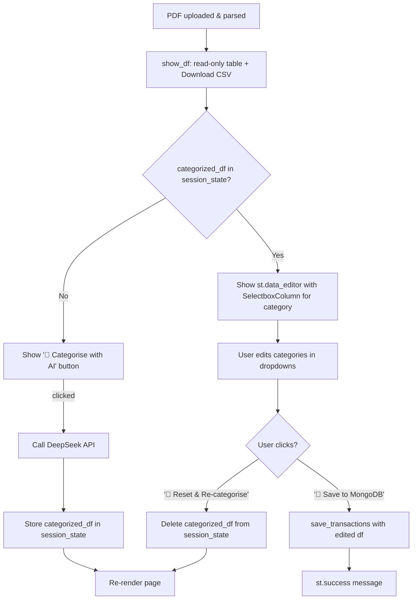

# Category Review Before Save — Implementation Plan

> **For Claude:** REQUIRED SUB-SKILL: Use superpowers:executing-plans to implement this plan task-by-task.

**Goal:** Add an editable review step between AI categorisation and MongoDB save, so the user can inspect and adjust categories before committing.

**Architecture:**
- Split the current single-step `_show_save_button()` in `webapp/app.py` into a two-phase flow driven by `st.session_state`:
  - Phase A — "🤖 Categorise with AI" button: calls DeepSeek, stores result in `st.session_state["categorized_df"]`.
  - Phase B — Editable review table (`st.data_editor` with `SelectboxColumn`) + "💾 Save to MongoDB" button that saves the *edited* DataFrame.
- `webapp/helpers.py` `categorize_and_save_df` is kept intact for backward-compat with existing tests; only `app.py` changes the UI orchestration.

**Tech Stack:** Python 3.12, Streamlit `st.data_editor`, `st.column_config.SelectboxColumn`, session state

**Status:** Draft

---

## Requirements

### User Stories
- As a user, after clicking "Categorise with AI", I want to see each transaction's AI-assigned category in an editable table so I can review it.
- As a user, I want a dropdown on each row to change the category to any of the 10 valid options so I can correct AI mistakes.
- As a user, I want to click "Save to MongoDB" only *after* I am happy with the categories, so I have full control over what is stored.
- As a user, I want a "Reset" option so I can re-run categorisation if I want a fresh AI pass.

### Acceptance Criteria
- Given a parsed DataFrame is displayed, when I click "Categorise with AI", then an editable table appears showing date / description / amount / bank / category columns.
- Given the editable table is shown, when I change a category in the dropdown, then the value updates in place.
- Given I have reviewed/edited the categories, when I click "Save to MongoDB", then only the edited values are saved (not the original AI values).
- Given the "Categorise with AI" button has already been clicked, when the page re-renders, then the editable table stays visible without re-calling the API.
- Given an API or DB error, when it occurs, then a clear error message is shown and the editable table remains visible.

---

## Architecture Changes

- Modify: `webapp/app.py` — replace `_show_save_button()` with two new functions:
  - `_show_categorise_button(df)` — shown when no `categorized_df` in session state
  - `_show_review_and_save(categorized_df)` — shown when `categorized_df` IS in session state; renders editable table + save + reset buttons
- No changes to `webapp/helpers.py`, `webapp/categorizer.py`, or `webapp/repository.py`.
- Modify: `tests/test_app.py` — add tests for the two new functions.

---

## User Flow (Mermaid)



---

## Implementation Steps

### Phase 1: Refactor `_show_save_button` into two-step flow

#### Task 1: Write failing tests for new functions

**Files:**
- Modify: `tests/test_app.py`

**Step 1: Write the failing tests**

Add these tests to `tests/test_app.py`:

```python
from unittest.mock import patch, MagicMock
import pandas as pd
import pytest


def make_raw_df():
    return pd.DataFrame([
        {"date": "2024-01-15", "description": "GRAB TAXI", "amount": -12.50, "bank": "DBS"},
        {"date": "2024-01-16", "description": "NTUC", "amount": -30.00, "bank": "DBS"},
    ])


def make_categorized_df():
    df = make_raw_df()
    df["category"] = ["Transport", "Food & Dining"]
    return df


def test_categorise_button_calls_categorize_transactions(mock_streamlit):
    """Clicking 'Categorise with AI' should call categorize_transactions and store result."""
    raw_df = make_raw_df()
    cat_df = make_categorized_df()

    with patch("webapp.app.st.button", return_value=True), \
         patch("webapp.app.st.spinner"), \
         patch("webapp.app.categorize_transactions", return_value=cat_df) as mock_cat, \
         patch("webapp.app.st.session_state", {}) as mock_state:
        from webapp.app import _show_categorise_button
        _show_categorise_button(raw_df)

    mock_cat.assert_called_once()


def test_review_and_save_calls_save_transactions(mock_streamlit):
    """Clicking 'Save to MongoDB' should call save_transactions with the edited df."""
    cat_df = make_categorized_df()

    with patch("webapp.app.st.data_editor", return_value=cat_df), \
         patch("webapp.app.st.button", side_effect=[True, False]), \
         patch("webapp.app.st.spinner"), \
         patch("webapp.app.save_transactions", return_value=2) as mock_save, \
         patch("webapp.app.st.success"):
        from webapp.app import _show_review_and_save
        _show_review_and_save(cat_df)

    mock_save.assert_called_once()
```

**Step 2: Run to verify failure**

```bash
pytest tests/test_app.py::test_categorise_button_calls_categorize_transactions tests/test_app.py::test_review_and_save_calls_save_transactions -v
```
Expected: FAIL with `ImportError: cannot import name '_show_categorise_button'`

---

#### Task 2: Replace `_show_save_button` with two new functions in `webapp/app.py`

**Files:**
- Modify: `webapp/app.py`

**Step 1: Update imports at top of `webapp/app.py`**

Replace:
```python
from webapp.helpers import categorize_and_save_df, create_df, parse_bank_statement, show_df
```

With:
```python
from webapp.categorizer import categorize_transactions
from webapp.helpers import create_df, parse_bank_statement, show_df
from webapp.repository import save_transactions
```

**Step 2: Update `app()` to use the two-step flow**

Replace the block:
```python
    if df is not None:
        show_df(df)
        _show_save_button(df)
```

With:
```python
    if df is not None:
        show_df(df)
        categorized_df = st.session_state.get("categorized_df")
        if categorized_df is None:
            _show_categorise_button(df)
        else:
            _show_review_and_save(categorized_df)
```

**Step 3: Replace `_show_save_button` with the two new functions**

Remove the old `_show_save_button` function entirely and add:

```python
def _show_categorise_button(df: pd.DataFrame) -> None:
    if st.button("🤖 Categorise with AI", type="primary"):
        try:
            with st.spinner("Asking DeepSeek to categorise your transactions…"):
                categorized = categorize_transactions(df)
            st.session_state["categorized_df"] = categorized
            st.rerun()
        except ValueError as e:
            st.error(f"Configuration error: {e}")
        except Exception as e:  # pylint: disable=broad-except
            st.error(f"Categorisation failed: {e}")


def _show_review_and_save(categorized_df: pd.DataFrame) -> None:
    from webapp.categorizer import VALID_CATEGORIES

    st.subheader("Review & Edit Categories")
    st.caption("Change any category in the dropdown, then click Save.")

    edited_df = st.data_editor(
        categorized_df,
        column_config={
            "category": st.column_config.SelectboxColumn(
                label="Category",
                options=VALID_CATEGORIES,
                required=True,
            ),
            "date": st.column_config.TextColumn("Date", disabled=True),
            "description": st.column_config.TextColumn("Description", disabled=True),
            "amount": st.column_config.NumberColumn("Amount", format="%.2f", disabled=True),
            "bank": st.column_config.TextColumn("Bank", disabled=True),
        },
        use_container_width=True,
        hide_index=True,
        num_rows="fixed",
        key="category_editor",
    )

    col1, col2 = st.columns([1, 4])

    with col1:
        if st.button("💾 Save to MongoDB", type="primary"):
            try:
                with st.spinner("Saving to MongoDB…"):
                    count = save_transactions(edited_df)
                st.success(f"✅ {count} transaction(s) saved to MongoDB.")
                # Clear categorized state so the UI resets to the categorise button
                del st.session_state["categorized_df"]
            except ValueError as e:
                st.error(f"Configuration error: {e}")
            except Exception as e:  # pylint: disable=broad-except
                st.error(f"Failed to save: {e}")

    with col2:
        if st.button("🔄 Reset & Re-categorise"):
            del st.session_state["categorized_df"]
            st.rerun()
```

**Step 4: Run tests to verify they pass**

```bash
pytest tests/test_app.py -v
```
Expected: PASS (all existing + new tests)

**Step 5: Commit**

```bash
git add webapp/app.py tests/test_app.py
git commit -m "feat: add editable category review step before MongoDB save"
```

---

### Phase 2: Full test suite check

#### Task 3: Verify no regressions

**Step 1: Run full test suite**

```bash
pytest tests/ -v
```
Expected: All tests pass.

**Step 2: Check for linter errors**

```bash
uv run ruff check webapp/app.py
```
Expected: No errors.

**Step 3: Commit plan status update**

```bash
git add docs/plans/2026-03-05-category-review-before-save.md
git commit -m "docs: mark category-review plan as complete"
```

---

## Testing Strategy

| Layer | File | What's tested |
|-------|------|---------------|
| Unit | `tests/test_app.py` | `_show_categorise_button` calls `categorize_transactions`; `_show_review_and_save` calls `save_transactions` |
| Existing regression | `tests/test_app.py` | Full PDF parse + display flow (must still pass) |
| Existing unit | `tests/test_helpers.py` | `categorize_and_save_df` still works (no changes to helpers.py) |

> Note: `st.data_editor` is hard to unit-test because it's a widget. The test stubs it with `patch("webapp.app.st.data_editor", return_value=cat_df)`.

---

## Risks & Mitigations

| Risk | Mitigation |
|------|------------|
| `st.data_editor` changes returned df shape on edit (adds index columns) | `num_rows="fixed"` prevents row add/delete; only `category` column is editable, so shape stays stable |
| Session state persists across page navigations, showing stale data | `del st.session_state["categorized_df"]` after save or reset clears it cleanly |
| `st.rerun()` causes full re-render, could confuse Streamlit widget state | The `key="category_editor"` on `data_editor` stabilises its identity across rerenders |
| Existing test `test_app` patches `get_files` but now `app()` references `categorize_transactions` and `save_transactions` at import time | These are only called from button handlers, not at import time — no issue |

---

## Success Criteria

- [ ] After processing a PDF, a "🤖 Categorise with AI" button appears (not "Save to MongoDB")
- [ ] Clicking it shows a spinner, then an editable table with a category dropdown per row
- [ ] Changing a dropdown updates the value without page reload
- [ ] Clicking "💾 Save to MongoDB" saves the *edited* categories and shows a success message
- [ ] After saving, the UI resets to show the "🤖 Categorise with AI" button again
- [ ] Clicking "🔄 Reset & Re-categorise" clears the editable table and shows the categorise button
- [ ] `pytest tests/ -v` — all tests pass
- [ ] `ruff check webapp/app.py` — no errors
