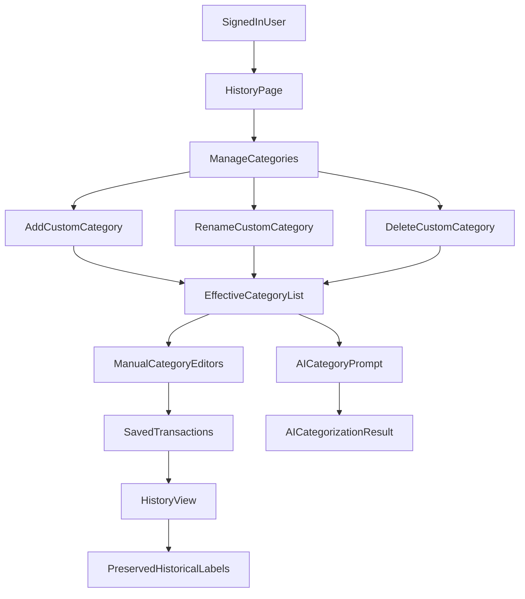

# Customizable Categories Plan

## Business Context

Today the product uses a fixed category list in [bankclaw/webapp/categorizer.py](bankclaw/webapp/categorizer.py), and that same list drives AI categorization plus the manual category selectors in [bankclaw/webapp/app.py](bankclaw/webapp/app.py), [bankclaw/webapp/pages/1_visualizations.py](bankclaw/webapp/pages/1_visualizations.py), and [bankclaw/webapp/pages/3_history.py](bankclaw/webapp/pages/3_history.py). The new feature should let each signed-in user manage personal categories while still keeping the built-in defaults available.

The chosen scope is a hybrid model: built-in defaults remain available, each user can CRUD their own custom categories, and rename/delete only affects future selection plus AI categorization. Historical saved transactions keep the original stored category labels.

## User Stories

- As a signed-in user, I want to add my own categories so the app matches my personal budgeting model.
- As a signed-in user, I want built-in defaults and my custom categories to appear together anywhere I categorize transactions.
- As a signed-in user, I want the AI categorizer to use my current active category list so its output matches what I can actually select.
- As a signed-in user, I want historical transactions to keep their original labels after a rename or delete so prior records remain unchanged.

## Acceptance Criteria

- Given I am signed in and have no custom categories, when I open category management, then I can see the built-in categories and add my own personal categories.
- Given I have custom categories, when I edit transactions in upload review or history, then the category dropdown shows built-in plus my active custom categories.
- Given I rename a custom category, when the change is saved, then future manual selection and AI categorization use the new name.
- Given I delete a custom category, when the delete is confirmed, then that category is no longer available for future manual selection or AI categorization.
- Given I renamed or deleted a category, when I view historical saved transactions, then existing records still display the original stored category value.
- Given AI categorization runs after category changes, when the system builds the prompt and validates model output, then it uses the current effective category list for that user instead of the old static list.
- Given category memory contains an inactive or deleted category, when categorization runs, then that stale memory entry is ignored and the system falls back to an active category result.

## User Journey




## Existing Patterns To Reuse

- Static source of truth today in [bankclaw/webapp/categorizer.py](bankclaw/webapp/categorizer.py):

```9:28:bankclaw/webapp/categorizer.py
VALID_CATEGORIES = [
    "Food & Dining",
    "Transport",
    "Shopping",
    "Entertainment",
    "Utilities",
    "Healthcare",
    "Travel",
    "Income",
    "Transfer",
    "Other",
]

_SYSTEM_PROMPT = """You are a bank transaction categoriser. Given a list of bank transaction descriptions,
return exactly one category per line in the same order. Output ONLY the category names, one per line, nothing else.

Valid categories: {categories}
""".format(
    categories=", ".join(VALID_CATEGORIES)
)
```

- Existing editable maintenance-style UI in [bankclaw/webapp/pages/3_history.py](bankclaw/webapp/pages/3_history.py):

```220:235:bankclaw/webapp/pages/3_history.py
edited_df = st.data_editor(
    df,
    column_config={
        _DELETE_COL: st.column_config.CheckboxColumn("🗑️"),
        "category": st.column_config.SelectboxColumn("Category", options=VALID_CATEGORIES, required=True),
        "date": st.column_config.TextColumn("Date", disabled=True),
        "description": st.column_config.TextColumn("Description", disabled=True),
        "amount": st.column_config.NumberColumn("Amount", format="%.2f", disabled=True),
        "bank": st.column_config.TextColumn("Bank", disabled=True),
        "saved_at": st.column_config.TextColumn("Saved At", disabled=True),
    },
```

- Existing Mongo repository style in [bankclaw/webapp/repository.py](bankclaw/webapp/repository.py):

```80:106:bankclaw/webapp/repository.py
def save_category_memory(
    df: pd.DataFrame,
    user_email: str,
    source: str = "manual",
    batch_size: int = 200,
) -> int:
    ...
    collection.create_index(
        [
            ("user_email", ASCENDING),
            ("normalized_description", ASCENDING),
        ],
        unique=True,
        background=True,
    )
```

## Scope

### In

- Per-user custom category CRUD on top of built-in defaults.
- Dynamic effective category list for manual editors and AI categorization.
- Forward-only rename/delete semantics.
- Guarding AI output and memory reuse against inactive categories.
- Tests in the existing split: [bankclaw/tests/unit](bankclaw/tests/unit), [bankclaw/tests/integration](bankclaw/tests/integration), and [bankclaw/tests/e2e](bankclaw/tests/e2e).

### Out

- Retroactive migration of existing saved transaction categories.
- Shared/global custom categories.
- Admin management of built-in defaults.
- Analytics remapping of old category names into renamed ones.
- Bulk repair of historical category-memory records beyond ignoring inactive values at runtime.

## Dependencies And Risks

- A new persisted category-definition model is required because categories are currently only hard-coded strings. This likely means a new Mongo collection or equivalent repository/index work in [bankclaw/webapp/repository.py](bankclaw/webapp/repository.py).
- Per your rule, implementation must pause before database persistence work so you can help with that database change.
- Historical records will legitimately show labels that are no longer selectable after rename/delete. That is expected in the chosen scope but should be called out in UI copy and tests.
- [bankclaw/webapp/app.py](bankclaw/webapp/app.py) currently calls categorization without `user_email`, so the plan must normalize all categorization entry points to use the active user context.

## Complexity Assessment

- E2E criteria met: user-facing UI, multi-layer change, AI integration, and stateful rename/delete behavior.
- Simplified-TDD criteria met: parts of the feature are still straightforward CRUD and repository/service logic.

### Recommendation

Use the E2E path, but keep it lightweight for this repo: one high-level pytest user-flow in [bankclaw/tests/e2e](bankclaw/tests/e2e) plus the bulk of coverage in unit and integration tests. This best matches the spec-driven workflow while staying aligned with the repo’s current mocked Streamlit test style.

## Execution Plan

### Phase 3: Gherkin-equivalent story coverage

- Draft a single user-story flow for: sign in, create custom category, use it in transaction editing, rerun categorization, and confirm the updated category list is used.
- Store the user-story test in [bankclaw/tests/e2e](bankclaw/tests/e2e) using the repo’s current pytest scenario style rather than browser automation.

### Phase 4-5: Implement in <=3-file batches

- Batch 1: add failing tests first.
  - [bankclaw/tests/integration/test_user_repository.py](bankclaw/tests/integration/test_user_repository.py)
  - [bankclaw/tests/unit/test_category_definitions.py](bankclaw/tests/unit/test_category_definitions.py)
  - [bankclaw/tests/e2e/test_category_management_flow.py](bankclaw/tests/e2e/test_category_management_flow.py)
- Batch 2: pause for database help, then add category-definition persistence and effective-category resolution.
  - [bankclaw/webapp/repository.py](bankclaw/webapp/repository.py)
  - [bankclaw/webapp/category_definitions.py](bankclaw/webapp/category_definitions.py)
- Batch 3: make AI categorization dynamic.
  - [bankclaw/webapp/categorizer.py](bankclaw/webapp/categorizer.py)
  - [bankclaw/tests/test_categorizer.py](bankclaw/tests/test_categorizer.py) or [bankclaw/tests/unit/test_categorizer.py](bankclaw/tests/unit/test_categorizer.py) depending on the existing pattern we extend
- Batch 4: add category management UI and replace static dropdown sources in the best maintenance surface first.
  - [bankclaw/webapp/pages/3_history.py](bankclaw/webapp/pages/3_history.py)
  - [bankclaw/tests/test_history.py](bankclaw/tests/test_history.py) or a new focused unit test file under [bankclaw/tests/unit](bankclaw/tests/unit)
- Batch 5: align the remaining categorization entry points.
  - [bankclaw/webapp/pages/1_visualizations.py](bankclaw/webapp/pages/1_visualizations.py)
  - [bankclaw/webapp/app.py](bankclaw/webapp/app.py)

## Verification

- Integration tests cover repository reads/writes, user scoping, duplicate handling, and soft-delete/inactive behavior for custom categories.
- Unit tests cover effective category resolution, duplicate-name validation, memory fallback behavior, and AI prompt/output validation.
- E2E test covers the user story of creating a custom category and seeing it propagate into manual selection and AI-driven categorization.
- Regression checks confirm existing historical transactions still display old labels, while deleted categories are not available for new selection.

## Progress Log

### Batch 1A

- Scope: started the test-first phase with a single pure-logic unit test file to stay within the user's smaller-task constraint.
- Actual files changed:
  - [bankclaw/tests/unit/test_category_definitions.py](bankclaw/tests/unit/test_category_definitions.py)
- Verification:
  - `uv run pytest tests/unit/test_category_definitions.py -q`
  - Result: expected RED state, failing with `ModuleNotFoundError: No module named 'webapp.category_definitions'`
- Deviation from original batch plan:
  - Split the original 3-file Batch 1 into smaller slices because the user requested tasks be broken down before touching 3 files.

### Batch 1B

- Scope: implemented the first pure-logic helper module needed by the failing unit tests, without introducing any database persistence.
- Actual files changed:
  - [bankclaw/webapp/category_definitions.py](bankclaw/webapp/category_definitions.py)
- Verification:
  - `uv run pytest tests/unit/test_category_definitions.py -q`
  - Result: GREEN, `8 passed`
  - `ReadLints` on `webapp/category_definitions.py` and `tests/unit/test_category_definitions.py`
  - Result: no linter errors
- Deviation from original batch plan:
  - Kept the slice focused on pure category-list rules only; repository and UI work remain pending.

### Batch 1C

- Scope: fixed review findings in the helper slice so malformed custom data cannot duplicate built-in categories and invalid non-string names are rejected.
- Actual files changed:
  - [bankclaw/webapp/category_definitions.py](bankclaw/webapp/category_definitions.py)
  - [bankclaw/tests/unit/test_category_definitions.py](bankclaw/tests/unit/test_category_definitions.py)
- Verification:
  - `uv run pytest tests/unit/test_category_definitions.py -q`
  - Result: GREEN, `10 passed`
  - `ReadLints` on `webapp/category_definitions.py` and `tests/unit/test_category_definitions.py`
  - Result: no linter errors
- Deviation from original batch plan:
  - None for this slice; this was a direct follow-up fix from code review findings.

### Batch 2A

- Scope: made AI categorization accept an active category list so future user-specific categories can flow into prompt generation, output sanitization, and stale-memory rejection before repository persistence is added.
- Actual files changed:
  - [bankclaw/tests/test_categorizer.py](bankclaw/tests/test_categorizer.py)
  - [bankclaw/webapp/categorizer.py](bankclaw/webapp/categorizer.py)
- Verification:
  - `uv run pytest tests/test_categorizer.py -q`
  - Result: GREEN, `13 passed`
  - `ReadLints` on `webapp/categorizer.py` and `tests/test_categorizer.py`
  - Result: no linter errors
- Deviation from original batch plan:
  - Deliberately added an `allowed_categories` seam first so the AI flow can be validated before the Mongo-backed category-definition repository exists.

### Batch 2B

- Scope: fixed the API contract gap found in review by requiring `allowed_categories` to include `Other`, which keeps fallback behavior inside the supplied category set.
- Actual files changed:
  - [bankclaw/webapp/categorizer.py](bankclaw/webapp/categorizer.py)
  - [bankclaw/tests/test_categorizer.py](bankclaw/tests/test_categorizer.py)
- Verification:
  - `uv run pytest tests/test_categorizer.py -q`
  - Result: GREEN, `14 passed`
  - `ReadLints` on `webapp/categorizer.py` and `tests/test_categorizer.py`
  - Result: no linter errors
- Deviation from original batch plan:
  - None; this was a direct follow-up from code review findings on the same slice.

### Batch 3A

- Scope: implemented the approved Mongo-backed custom-category repository primitives for save, read, and archive using `user_email + normalized_name` as the unique key.
- Actual files changed:
  - [bankclaw/tests/integration/test_user_repository.py](bankclaw/tests/integration/test_user_repository.py)
  - [bankclaw/webapp/repository.py](bankclaw/webapp/repository.py)
- Verification:
  - `uv run pytest tests/integration/test_user_repository.py -q`
  - Result: GREEN, `12 passed`
  - `ReadLints` on `webapp/repository.py` and `tests/integration/test_user_repository.py`
  - Result: one pre-existing Sonar warning on an unchanged hard-coded password test string in `tests/integration/test_user_repository.py`
- Deviation from original batch plan:
  - Started repository persistence immediately after the user approved the Mongo shape, so the original database pause is now resolved.

### Batch 3B

- Scope: fixed review findings in the repository slice so archived categories are hidden from default reads and invalid non-string names are rejected consistently.
- Actual files changed:
  - [bankclaw/webapp/repository.py](bankclaw/webapp/repository.py)
  - [bankclaw/tests/integration/test_user_repository.py](bankclaw/tests/integration/test_user_repository.py)
- Verification:
  - `uv run pytest tests/integration/test_user_repository.py -q`
  - Result: GREEN, `20 passed`
  - `ReadLints` on `webapp/repository.py` and `tests/integration/test_user_repository.py`
  - Result: one pre-existing Sonar warning on an unchanged hard-coded password test string in `tests/integration/test_user_repository.py`
- Deviation from original batch plan:
  - Added a small stateful round-trip test helper inside the integration file to verify archive filtering behavior without introducing new infrastructure.

### Batch 3C

- Scope: wired the category-definition helper to the repository so the app can resolve effective per-user categories from active custom-category documents.
- Actual files changed:
  - [bankclaw/tests/unit/test_category_definitions.py](bankclaw/tests/unit/test_category_definitions.py)
  - [bankclaw/webapp/category_definitions.py](bankclaw/webapp/category_definitions.py)
- Verification:
  - `uv run pytest tests/unit/test_category_definitions.py -q`
  - Result: GREEN, `12 passed`
  - `ReadLints` on `webapp/category_definitions.py` and `tests/unit/test_category_definitions.py`
  - Result: no linter errors
- Deviation from original batch plan:
  - Kept the resolver strict after review: repository failures now propagate instead of silently hiding custom categories behind a default fallback.

### Batch 4A

- Scope: wired dynamic category resolution into the history page, and then adjusted the UX so legacy archived-category rows are shown read-only after the user explicitly chose that behavior instead of making archived labels globally selectable again.
- Actual files changed:
  - [bankclaw/tests/test_history.py](bankclaw/tests/test_history.py)
  - [bankclaw/webapp/pages/3_history.py](bankclaw/webapp/pages/3_history.py)
- Verification:
  - `uv run pytest tests/test_history.py -q`
  - Result: GREEN, `12 passed`
  - `ReadLints` on `webapp/pages/3_history.py` and `tests/test_history.py`
  - Result: no linter errors
- Deviation from original batch plan:
  - The original acceptance wording suggested legacy rows should remain editable, but Streamlit uses one shared select-option list for the whole column. After clarifying with the user, this slice intentionally uses a safer read-only presentation for legacy-category rows while keeping active-category rows editable.
  - When dynamic category lookup fails, this page now degrades to a fully read-only view with CSV export instead of attempting editable fallback behavior that could re-enable archived categories or misclassify custom ones.

### Batch 4B

- Scope: wired dynamic category resolution into the visualizations upload/review dialog so AI processing and manual review both use user-specific category options.
- Actual files changed:
  - [bankclaw/tests/test_visualizations.py](bankclaw/tests/test_visualizations.py)
  - [bankclaw/webapp/pages/1_visualizations.py](bankclaw/webapp/pages/1_visualizations.py)
- Verification:
  - `uv run pytest tests/test_visualizations.py -q`
  - Result: GREEN, `34 passed`
  - `ReadLints` on `webapp/pages/1_visualizations.py` and `tests/test_visualizations.py`
  - Result: no linter errors
- Deviation from original batch plan:
  - Added a small stability mechanism for upload review by storing the category options used during AI processing.
  - After product clarification, the review dialog now blocks editing/saving and requires reprocessing when the live category list changes, or when live category validation becomes unavailable during an in-progress review.

### Batch 4C

- Scope: added the category management UI to the history page, giving users a collapsible "Manage Categories" section to list all active categories, add custom ones with validation, and archive (soft-delete) custom categories.
- Actual files changed:
  - [bankclaw/tests/test_history.py](bankclaw/tests/test_history.py)
  - [bankclaw/webapp/pages/3_history.py](bankclaw/webapp/pages/3_history.py)
- Key new functions in `3_history.py`:
  - `_render_category_manager(user_email)` — entry point; wraps the expander and delegates to sub-helpers.
  - `_render_add_category_form(user_email, custom_names)` — text input + "Add Category" button; validates via `validate_custom_category_name`, persists via `save_custom_category`, shows inline errors on conflict.
  - `_render_custom_categories_list(user_email, custom_names)` — lists all active categories (defaults read-only, custom with "Archive" button); archive calls `archive_custom_category` and triggers rerun.
- New tests in `test_history.py`:
  - `test_category_manager_renders_active_custom_categories` — verifies expander is rendered and `get_custom_categories` is called for the right user.
  - `test_category_manager_add_category_calls_save` — verifies that clicking "Add Category" calls `save_custom_category` with the validated name.
  - `test_category_manager_archive_category_calls_archive` — verifies that clicking "Archive" for a custom category calls `archive_custom_category`.
  - `test_category_manager_invalid_name_shows_error` — verifies that validation errors surface as `st.error` messages and `save_custom_category` is never called.
- Verification:
  - `uv run pytest tests/test_history.py tests/test_categorizer.py tests/test_visualizations.py tests/unit/ -q --tb=short`
  - Result: GREEN, `91 passed`
  - `ReadLints` on `webapp/pages/3_history.py`
  - Result: no linter errors

