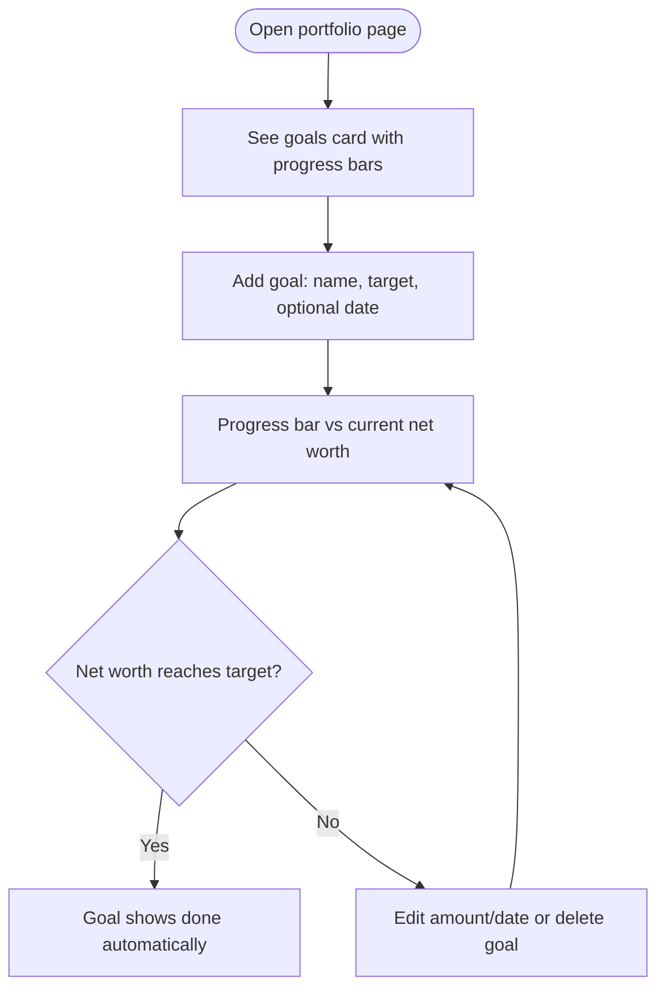

# Portfolio Net-Worth Goals Implementation Plan

> **For Agent:** Execute this plan task-by-task. Follow each step exactly, verify test results before proceeding, and commit after each task.
> **TDD Rule:** No production code without a failing test first.

**Goal:** Users maintain multiple net-worth milestone goals with optional target dates; the portfolio page shows each goal's progress computed from current net worth.
**Architecture:** Mirror the custom-asset-types pattern exactly: one new Mongo collection (`portfolio_goals`) with CRUD in `portfolio_repository.py`, thin FastAPI routes in `api.py`, and a goals card in `page-portfolio.jsx` that reuses the client-side net-worth totals. No server-side progress math.
**Tech Stack:** Python/FastAPI, MongoDB (pymongo), React (in-file JSX), pytest, node:test.
**Complexity Path:** `Simplified TDD path` (user choice, 2026-08-24)
**Status:** Complete

---

## 0. Intent

- **Problem:** Portfolio mode tracks net worth but gives users nothing to aim at.
- **Proposed outcome:** Multiple net-worth milestone goals, optional target date, progress bars on the portfolio page, auto-computed "done".
- **Affected systems:** `webapp/portfolio_repository.py`, `webapp/api.py`, `dashboard/app/page-portfolio.jsx`, `tests/test_portfolio_api.py`, `tests/integration/test_portfolio_repository.py`, `dashboard/app/page-portfolio.test.js`.
- **Constraints:** Existing repo patterns (per-user email scope, `_serialize`, validation helpers, `_ensure_indexes`), existing auth, existing test conventions.
- **Resolved decisions:** net-worth targets; multiple/milestone-style (user, 2026-08-24).
- **Confirmed assumptions:** target date optional; "done" computed (net worth ≥ target); sorted by target ascending; single currency; full CRUD.
- **Out of scope:** asset-linked/debt-payoff goals; notifications; AI Coach awareness; projections; goal archival.
- **Open questions:** none.

## Requirements

### User Stories
- As a portfolio user, I want to set net-worth milestones, so that I have concrete targets to work toward.
- As a portfolio user, I want each milestone to show progress against my current net worth, so that I can see how far I've come without doing math.
- As a portfolio user, I want to edit or remove a milestone, so that my goals stay current as life changes.

### Acceptance Criteria
- **AC1:** Given I am on the portfolio page, when I add a goal with a name and target amount (and optionally a date), then it appears in the goals card sorted by target amount ascending.
- **AC2:** Given goals exist, when the card renders, then each shows progress = current net worth / target (capped at 100%), and a goal whose target ≤ net worth shows as done.
- **AC3:** Given a goal exists, when I edit its name, amount, or date, or delete it, then the change persists and the card updates.
- **AC4:** Given another user's goals exist, when I fetch goals, then I only ever see my own (user-email scoping, as with all portfolio collections).
- **AC5:** Given the API receives an invalid payload (empty name, non-positive amount, malformed date), then it responds 400 with the validation message.

### User Journey

### Dependencies
- Existing: `get_db()`, `_current_user`, `_MONGO` guard, validation helpers (`_clean_str`, `_coerce_value`, `_normalize_as_of_date` pattern), `list_portfolio` totals already consumed by the page.

### Scope
- **In:** `portfolio_goals` collection + CRUD; 4 API routes; goals card UI; unit/integration/JS tests.
- **Out:** everything in the Intent's out-of-scope list.

## Shape — Ladder Pass

| Candidate | Rung reached | Kept / Skipped | Reason (one line) |
|---|---|---|---|
| Repository CRUD for `portfolio_goals` | 2→7 | Kept | Mirrors asset-types pattern; minimum new code on an existing template |
| API routes (GET/POST/PATCH/DELETE) | 2→7 | Kept | Same thin-route shape as asset-types |
| Goals card in page-portfolio.jsx | 2→7 | Kept | Reuses existing net-worth totals, form and card idioms |
| Server-side progress endpoint | 2 | **Skipped** | skipped: client already has net worth; add when a non-JS consumer needs progress |
| Progress history / projection math | 1 | **Skipped** | skipped: speculative; add when users ask "am I on track" |
| Goal ordering field | 3 | **Skipped** | skipped: sort by target amount covers it; add when users want manual order |
| Celebration/notification on completion | 1 | **Skipped** | skipped: out of scope per Intent |

All kept tasks fit one session; blocking edges: Task 1 → Task 2 → Task 3.

## Implementation Steps

### Phase 1: Repository (Task 1)
**Files:** Modify `webapp/portfolio_repository.py`; Test `tests/integration/test_portfolio_repository.py`
Collection `portfolio_goals`: `user_email`, `name`, `target_amount` (float > 0), `target_date` (optional ISO date or None), `created_at`, `updated_at`. Index: `(user_email, target_amount)`. Functions: `list_goals`, `create_goal`, `update_goal`, `delete_goal` — validation via existing helpers; `_serialize_goal` mirrors `_serialize_asset_type`.
RED: integration tests (mock-db pattern of `test_custom_asset_type_crud_is_user_scoped`) for CRUD + user scoping + validation errors. GREEN: implement. REFACTOR. Verify: `uv run pytest tests/integration/test_portfolio_repository.py`.
COMMIT: `feat(portfolio): add net-worth goal repository`

### Phase 2: API (Task 2)
**Files:** Modify `webapp/api.py`; Test `tests/test_portfolio_api.py`
Routes mirroring asset-types exactly: `GET/POST /api/portfolio/goals`, `PATCH/DELETE /api/portfolio/goals/{goal_id}` — `_MONGO` guard, ValueError → 400.
RED: api tests per `_JsonRequest` conventions (scoping, error mapping). GREEN. REFACTOR. Verify: `uv run pytest tests/test_portfolio_api.py`.
COMMIT: `feat(portfolio): add goal CRUD API routes`

### Phase 3: UI (Task 3)
**Files:** Modify `dashboard/app/page-portfolio.jsx`; Test `dashboard/app/page-portfolio.test.js`
GoalsCard: list sorted by target ascending; per-goal progress bar `min(netWorth/target, 1)`; done state when `netWorth >= target`; add/edit/delete via the new API; follows existing card/form idioms (`useStatePF`, existing fetch helper).
RED: node:test source assertions per existing pattern. GREEN. REFACTOR. Verify: `node --test dashboard/app/page-portfolio.test.js`.
COMMIT: `feat(portfolio): goals card with net-worth progress`

## Testing Strategy
- Integration: repository CRUD, scoping, validation (mock-db pattern)
- Unit/API: route auth scoping, 400 mapping, `_MONGO` guard
- JS: source assertions per existing `page-portfolio.test.js` pattern
- Full run before Verify: `uv run pytest . && uv run ruff check . && node --test dashboard/app/page-portfolio.test.js`

## Risks & Mitigations
- **Risk:** Net worth on the page and stored goal targets drift in currency assumptions → Mitigation: single-currency assumption confirmed in Intent; no conversion logic anywhere.
- **Risk:** New index creation on shared collections → Mitigation: `_ensure_indexes` is idempotent/background, same as existing.

## Success Criteria
- [x] AC1–AC5 demonstrably met (Spec axis: all MET with evidence)
- [x] All tests pass (88 python non-e2e, 5/5 JS suites); lint: no new violation classes vs baseline (155→169 style-rule findings are the file's pre-existing families; pre-commit hooks passed)
- [x] Tri-axis review run, findings recorded and fixed
- [x] Evidence in Progress Log before status → Complete

## Progress Log

| Date | Task | Status | Notes |
|---|---|---|---|
| 2026-08-24 | Plan authored | Done | Intent confirmed; ladder recorded 4 skipped candidates |
| 2026-08-24 | Task 1 Repository | Done | RED (ImportError on new functions) → GREEN: 12 passed integration; commit 497229f |
| 2026-08-24 | Task 2 API | Done | RED → GREEN: 9 passed api tests; commit 54a8a15. Found pre-existing suite-ordering bug (module-level sys.modules stubs) — proven on HEAD~2, not a regression |
| 2026-08-24 | Task 3 UI | Done | RED (2 failing source tests) → GREEN: 7 passed; commit fbd4dcb |
| 2026-08-24 | Verification evidence | Done | `uv run pytest tests/integration tests/unit tests/test_*.py` → **88 passed**; all 5 JS suites pass (exit codes); project command `uv run pytest .` exceeds 2m on tests/e2e — scoped run stated per flow. Ruff (project config): 169 vs 155 baseline on the two files, all same pre-existing rule families (TRY003/EM101/FAST002); no findings on goal lines; pre-commit hooks passed on all commits |
| 2026-08-24 | Tri-axis review | Done | **Standards: Block** — 1 HIGH (deleteGoal silent failure), 3 MEDIUM (fetch-error blanks list, id encoding, missing aria-labels), 4 nits. **Spec: AC1–AC5 all MET**, out-of-scope clean; 2 Important (worktree riders = user's pre-existing edits, not this feature's; plan bookkeeping → this row), 2 nits. **Simplicity:** all 4 skipped candidates stayed skipped; 1 rung-2 miss (duplicated date normalizer), delete-catch convergence, 3 nits |
| 2026-08-24 | Review fixes | Done | All HIGH/MEDIUM + accepted nits fixed in one pass: delete errors surface in card, goals fetch throws like siblings, encodeURIComponent, aria-labels ×6, functional setDraft, date normalizer deduped via field param, 400-detail asserted, rung-1 reached-counter dropped. 74 python + JS suites green; commit follows |
| 2026-08-24 | Learn-back | Done | Two entries → CLAUDE.md Lessons: grep-pipeline test misreads (3rd occurrence); pytest e2e timeout + suite ordering sensitivity |
| 2026-08-24 | Post-QA fix: dedicated Goals page | Done | User QA: sidebar Library→Goals routed to a hardcoded "Coming soon" placeholder in shell.jsx that Phase 1 research never found (grep was filtered to *.py — dashboard JS never searched for "goal"). Fix: pf-goals now routes into PortfolioPage; `sub === "pf-goals"` renders a dedicated Goals view; GoalsCard removed from the wealth flow (no duplication). RED test added, 8/8 pass |
| — | Deferred (noted, not fixed) | — | Pre-existing: suite ordering bug; page-portfolio.jsx >1100 lines (lift GoalsCard out at next touch); behavioral JS tests beyond source-regex house style; AGENTS.md double-9 numbering sits in user's uncommitted edits |
