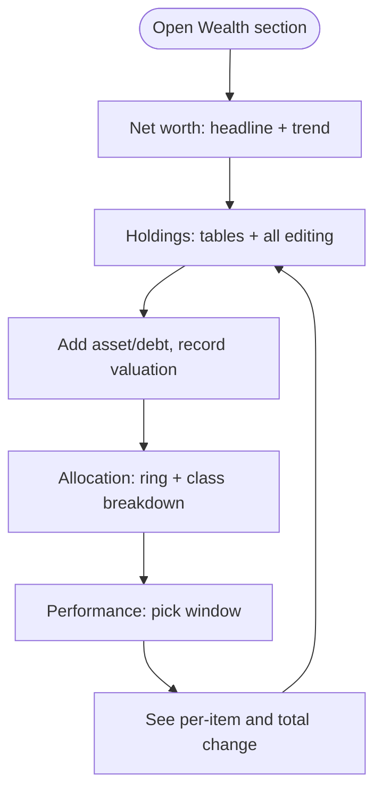

# Wealth Tab Differentiation Implementation Plan

> **For Agent:** Execute this plan task-by-task. Follow each step exactly, verify test results before proceeding, and commit after each task.
> **TDD Rule:** No production code without a failing test first.

**Goal:** Each Wealth tab (Net worth, Holdings, Allocation, Performance) shows distinct content and functions instead of the identical full page.
**Architecture:** Gate existing sections of the portfolio page by the already-routed `sub` prop at their natural boundaries; one new pure function in the data module computes Performance rows from the valuation histories the page already fetches. No API or DB changes.
**Tech Stack:** React (in-file JSX), plain JS data module, node:test.
**Complexity Path:** `Simplified TDD path` (user, 2026-08-24)
**Status:** Complete

---

## 0. Intent

- **Problem:** The four Wealth tabs are separate nav items but render identical content — the navigation is a lie.
- **Proposed outcome:** Net worth = hero + chart + summary stats; Holdings = asset/debt tables with all CRUD; Allocation = ring + new per-class breakdown; Performance = new per-item change table with 1M/3M/1Y/All picker and net-worth total row, all client-side.
- **Affected systems:** dashboard portfolio page, dashboard data module, their two test files.
- **Constraints:** Existing panel idioms; `sub` routing already delivered by the shell — shell untouched; Goals page untouched.
- **Resolved decisions:** redistribute + build thin tabs (user); Performance = change table + period picker (user); seams = data-module pure function + source assertions (user, seam gate).
- **Confirmed assumptions:** tabs show strictly own content; Equity-exposure + Liquidity stat blocks move to Allocation; CRUD on Holdings only; title/subtitle adapt per tab; debt Δ% shown from the debt's perspective (falling balance = good).
- **Out of scope:** Goals/Linked accounts pages; new chart libs; server-side aggregation; new endpoints; mobile-specific layouts.
- **Open questions:** none.

## Problem Statement

Clicking between Net worth, Holdings, Allocation, and Performance changes nothing — every tab shows the same long page. Users can't trust the navigation, and the page is a wall of everything.

## Solution

Each tab becomes a focused view: the number and trend (Net worth), the things you own and owe with all editing functions (Holdings), how assets are distributed (Allocation), and how each position has moved over a chosen window (Performance).

## User Stories

1. As a portfolio user, I want the Net worth tab to show just my net worth, its 12-month trend, and summary stats, so that I get the headline picture without scrolling past tables.
2. As a portfolio user, I want the Holdings tab to hold the asset and liability tables, so that I know where to go to see everything I own and owe.
3. As a portfolio user, I want all add/edit/delete and valuation-recording functions to live on Holdings, so that editing has one home.
4. As a portfolio user, I want the Allocation tab to show the allocation ring plus a per-class breakdown (value, share of assets, position count), so that I can see concentration at a glance.
5. As a portfolio user, I want my equity-exposure and liquidity stats on the Allocation tab, so that distribution-related numbers sit with the distribution view.
6. As a portfolio user, I want the Performance tab to list each asset and debt with its current value, absolute change, and percent change over a window I pick (1M/3M/1Y/All), so that I can see what moved.
7. As a portfolio user, I want a sparkline per Performance row, so that I can see the shape of the movement, not just the endpoints.
8. As a portfolio user, I want a net-worth total row on Performance, so that I can see the overall move for the same window.
9. As a portfolio user, I want a debt's improvement (falling balance) shown as a positive move, so that paying down debt reads as progress.
10. As a portfolio user, I want items with no valuations inside the window to show "—" rather than a misleading 0%, so that missing data is not mistaken for flat performance.
11. As a portfolio user, I want each tab's title and subtitle to name what I'm looking at, so that the page confirms where I am.
12. As a portfolio user, I want deep links (e.g. straight to Performance) to keep working, so that bookmarks and refreshes land on the right view.

## Acceptance Criteria

- **AC1:** Given I open the Net worth tab, When it renders, Then I see the hero amount, delta, 12-month chart, and Assets/Liabilities/Debt-ratio strip — and no asset/debt tables, ring, or performance table.
- **AC2:** Given I open the Holdings tab, When it renders, Then I see the assets and liabilities tables with add/edit/delete, kind filter, type manager, and valuation recording — and no hero chart, ring, or performance table.
- **AC3:** Given I open the Allocation tab, When it renders, Then I see the allocation ring, a per-class breakdown table (class, value, % of assets, positions), and the Equity-exposure and Liquidity stats.
- **AC4:** Given I open the Performance tab and pick a window, When rows compute, Then each item shows current value, Δ, Δ% for that window, a sparkline, and a net-worth total row; debts show improvement as positive; items with no in-window data show "—".
- **AC5:** Given any direct navigation to a tab id, When the page mounts, Then the corresponding view renders (no dependence on visiting Net worth first).

## User Journey

## Implementation Decisions

- Tab identity arrives through the already-routed sub identifier; the shell is not modified.
- Section gating happens at the existing section boundaries of the portfolio page; sections are moved, not rewritten.
- All Performance math lives in one new pure function in the data module, computed from already-fetched valuation histories; the view only renders its rows. No new API.
- Window cutoff reuses the data module's existing month-window and latest-at-date logic.
- Δ% baseline is the latest valuation at or before the window start; absent that, the earliest in-window valuation; absent any in-window data, the row shows no percentage.
- Debt rows negate the delta for display so pay-down reads positive.
- The period picker reuses the existing segmented-button idiom.
- Per-class breakdown derives from the existing allocation computation plus a per-class position count.

## Testing Decisions

- A good test here feeds data in and asserts outputs — external behavior only, no implementation details.
- Seam 1 (behavioral): the new performance-computation function, tested in the data module's existing test file alongside its siblings (prior art: "portfolio net worth only emits months with real valuation activity").
- Cases locked down: window filtering, Δ/Δ% math, debt sign, no-data rows, zero-baseline guard, total row equals sum of item moves.
- Seam 2 (wiring): source assertions in the portfolio page's test file per house style (prior art: the pf-goals routing test).

## Out of Scope

Goals and Linked accounts pages; chart libraries; server-side aggregation; new endpoints; mobile-specific layouts.

## Further Notes

The `sub` prop was wired through the shell for the Goals page fix; this feature is the first full use of it.

## Shape — Ladder Pass

| Candidate | Rung reached | Kept / Skipped | Reason (one line) |
|---|---|---|---|
| Gate existing sections by `sub` | 2→6 | Kept | Sections exist; gating is conditionals at existing boundaries |
| `computePortfolioPerformance` in data module | 2→7 | Kept | New math, but reuses `_portfolioSortedValuations`/`_portfolioLatestAt`; one function, one seam |
| Per-class breakdown table | 2→7 | Kept | Derives from existing `allocation` memo + a count |
| Period picker | 2 | Kept | Existing `seg` button idiom, four static options |
| Tab-level React router / URL params | 1 | **Skipped** | skipped: shell nav already routes; add when shareable URLs are requested |
| Per-tab lazy data fetching | 1 | **Skipped** | skipped: page already fetches once for all tabs; add when payload size hurts |
| New chart for Performance | 1 | **Skipped** | skipped: MiniSpark exists; add when users ask for bigger charts |
| Extracting tabs into separate files | 1 | **Skipped** | skipped: file is over guideline already but splitting is refactor scope; add at next dedicated refactor (noted in goals plan too) |

Session-size: three tasks, one session each; blocking edge: Task 1 (data fn) → Task 3 (Performance view); Task 2 (gating) independent.

## Implementation Steps

### Task 1: `computePortfolioPerformance` (data module) — behavioral TDD
RED: behavioral tests in the data test file (window filter, Δ/Δ%, debt sign, no-data "—", zero baseline, total row). GREEN: implement in data module reusing existing private helpers. Verify: `node --test dashboard/app/data.test.js`.
COMMIT: `feat(portfolio): compute per-item performance from valuation history`

### Task 2: Gate sections by tab
RED: source assertions for the four `sub` branches. GREEN: conditionals at section boundaries; move stat blocks per Intent; per-tab title/subtitle. Verify: `node --test dashboard/app/page-portfolio.test.js`.
COMMIT: `feat(portfolio): each wealth tab renders its own view`

### Task 3: Allocation breakdown + Performance table
RED: source assertions (breakdown table, period picker, performance rows call the Task 1 function). GREEN: render both new sections. Verify: both test files + full JS sweep.
COMMIT: `feat(portfolio): allocation breakdown and performance change table`

## Testing Strategy
Seam 1 behavioral (data.test.js), Seam 2 wiring (page-portfolio.test.js), full JS sweep by exit code, non-e2e pytest untouched (no backend change — run once at Verify to prove it).

## Risks & Mitigations
- **Risk:** Sparse valuation data makes windows empty → "—" rows per AC4; total row falls back to the same baseline rule.
- **Risk:** Moving sections breaks add/edit state handlers that assume co-rendered sections → all state stays in the page component; only JSX placement moves.

## Success Criteria
- [x] AC1–AC5 met (Spec axis: all MET with line-level evidence)
- [x] All JS suites pass (exit-code sweep, 14 data tests incl. 4 review regressions); 68 non-e2e python tests pass, backend untouched; esbuild JSX check clean
- [x] Tri-axis review run, findings recorded and fixed
- [x] Evidence in Progress Log before Complete

## Progress Log

| Date | Task | Status | Notes |
|---|---|---|---|
| 2026-08-24 | Plan authored | Done | Grilling + to-spec + code-constraints read this session; seam gate confirmed by user; ladder recorded 4 skipped candidates |
| 2026-08-24 | Branch | Done | feat/wealth-tab-differentiation (branch-first rule) |
| 2026-08-24 | Task 1 data fn | Done | RED (ReferenceError) → GREEN 10/10 behavioral tests; commit d374120 |
| 2026-08-24 | Task 2 tab gating | Done | RED → GREEN; surgery broke a fragment closer, caught by esbuild JSX check (source-regex tests could not see it), fixed; commit d6f37aa |
| 2026-08-24 | Task 3 breakdown + performance | Done | RED → GREEN; full JS sweep + 68 py pass; commit 7af83cd |
| 2026-08-24 | Tri-axis review | Done | **Standards: Block** — HIGH: month-end window rollover (verified repro: 1M window on Mar 30 cut at Mar 2); MEDIUM: debt sparkline contradicted its green Δ column; 4 nits. **Spec: faithful** — AC1–AC5 MET; 2 nits (empty-state CRUD leak, log evidence). **Simplicity:** MEDIUM: breakdown table duplicated the alloc-leg legend with divergent formulas (one NaN-prone) — deletion was the lower rung; 4 trims; skipped-list audit clean |
| 2026-08-24 | Review fixes | Done | Window clamped at month ends (+3 regression tests incl. leap day); debt series sign-aligned (+1 test); alloc-leg legend deleted (table is the legend); ring-center NaN guarded; months coerced like sibling; perfRows rename; tab lookup hoisted; grid-2 override → plain div; total.current dropped. 14/14 data tests, sweep clean; commit follows |
| 2026-08-24 | Deferred | — | Empty-state CRUD leak on non-Holdings tabs: pre-existing, fix needs an onNav prop through shell.jsx which this plan scoped out — skipped: route empty-state buttons to Holdings, add when shell is next touched. Perf `current` uses latest valuation vs hero's item.value — known ceiling, server keeps them synced |
