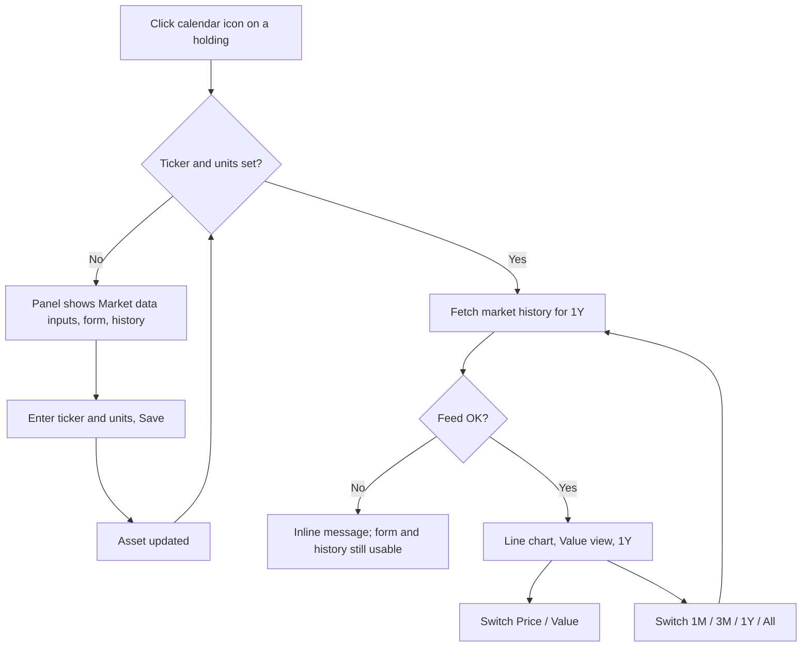

# Holding price & market-value trend — Specification

## Problem Statement
A holding such as ADSK (672 units) shows only the values the user typed by hand. With one recorded valuation the holdings table says "1 point" and the valuation panel is a bare list. The user cannot see how the share price has moved, nor what the position has been worth over time, without looking it up elsewhere and re-typing numbers.

## Solution
In the holding's valuation panel (the calendar icon on a row), the user sets a **Ticker** and **Units** once. The panel then shows a line chart of the fetched daily close converted to S$ — switchable between **Price** (per unit) and **Value** (units × price) — over a **1M / 3M / 1Y / All** range. Fetched data is display-only; recorded valuations and net worth are untouched. Holdings without ticker + units look exactly as they do today.

## User Stories
1. As an investor, I want to record the ticker and number of units for a holding, so that the app knows what to price.
2. As an investor, I want to see the share price trend for a holding, so that I understand how the market has moved without leaving the app.
3. As an investor, I want to see the trend of what my position is worth (units × price), so that I see the money impact, not just the price.
4. As an investor, I want both trends in S$, so that they read the same as the rest of my portfolio.
5. As an investor, I want to switch between Price and Value with one click, so that I don't need two charts.
6. As an investor, I want to choose 1M / 3M / 1Y / All, so that I can zoom from recent moves to the full history.
7. As an investor, I want holdings that trade in S$ (e.g. SGX stocks) to show unconverted, so that no spurious FX noise is added.
8. As an investor, I want a clear message when prices can't be fetched (offline, unknown ticker), so that I know why the chart is missing and nothing else breaks.
9. As an investor, I want my hand-recorded valuations and net worth to stay exactly as they are, so that the market feed never rewrites my records.
10. As a cash/property holder, I want holdings without a ticker to behave as before, so that the feature is opt-in.
11. As an investor, I want to correct a ticker or update units later, so that a typo or a new purchase is fixable in place.
12. As an investor, I want the chart to appear quickly on repeated opens, so that browsing holdings doesn't re-hit the market every time.

## Acceptance Criteria
- **AC1:** Given the valuation panel is open for an asset, When I enter a ticker `ADSK` and units `672` and save, Then the asset stores both and they are shown pre-filled the next time the panel opens.
- **AC2:** Given an asset has ticker and units, When the panel opens, Then a line chart of the price in S$ appears above the history list, defaulting to **Value** view and **1Y** range.
- **AC3:** Given the chart is shown, When I click **Price**, Then the line shows the per-unit price in S$; When I click **Value**, Then the line shows units × price in S$.
- **AC4:** Given the chart is shown, When I click **1M**, **3M**, **1Y** or **All**, Then the line covers that period (All = full available history).
- **AC5:** Given the ticker trades in USD, Then each point's price is close × USD→SGD rate for the latest FX date on or before that day.
- **AC6:** Given the ticker trades in SGD, Then prices are shown unconverted.
- **AC7:** Given the ticker is unknown or the market feed is unreachable, When the panel opens, Then an inline message replaces the chart and the valuation form and history list still work.
- **AC8:** Given an asset has no ticker or no units, When the panel opens, Then no chart or fetch happens and the panel shows the Market data inputs plus the existing form and list only.
- **AC9:** Given the chart has loaded, Then `asset.value`, the recorded valuations, the table's Value / Δ / Trend columns and net worth are unchanged.
- **AC10:** Given the same ticker and range were fetched within the last hour, When the panel opens again, Then the data is served from cache without re-hitting the feed.
- **AC11:** Given I enter units that are negative or not a number, When I save, Then the save is rejected with a message and the stored asset is unchanged.

## User Journey

## Test Points
1. Pure market-series builder (native closes + FX closes + units → S$ points, FX forward-filled) — primary.
2. Market-history API route — 400 / 502 / happy path / cache hit.
3. Asset repository `units` handling on create and update.
4. Pure JS chart-data builder (mode selection + sparse month labels) and source-assertion wiring checks for the panel.

## Implementation Decisions
- Market data comes from yfinance (new dependency). One adapter function fetches a ticker's history for a range; the ticker's currency comes from the same library.
- Range → feed request: 1M = 1 month daily, 3M = 3 months daily, 1Y = 1 year daily, All = full history at weekly interval (bounds point count).
- FX: when the ticker's currency is not SGD, fetch the `{CUR}SGD=X` pair for the same range and forward-fill by date onto the stock's dates. Dates are taken from the feed as ISO `YYYY-MM-DD` strings and never re-parsed through JS `Date`.
- New read-only endpoint on the asset: `GET …/assets/{id}/market-history?range=1M|3M|1Y|All` returning `{ticker, currency, units, points: [{date, price, value}]}` with `price`/`value` in S$. Errors: 400 (no ticker/units, bad range), 404 (asset not found — via the existing ValueError→400 convention if simpler), 502 (feed failure / unknown ticker), 503 (no database).
- The asset gains a numeric `units` field (≥ 0), accepted by the existing create and update paths; the existing PATCH route and client function carry ticker + units — no new write endpoint.
- Caching: in-process dictionary keyed by (ticker, range) with a 1-hour TTL. `ponytail:` per-process only; move to Mongo if the app runs multi-worker.
- yfinance is imported lazily inside the adapter, not at module import, so route tests that stub `pandas` keep working.
- UI: the existing `NetWorthChart` gains two behaviour-neutral tweaks (skip points with empty labels; optional tick formatter) and is reused for the panel chart. The existing `.seg` pill pattern is reused for both the Price | Value toggle and the range pill. The panel gets a "Market data" row (Ticker, Units, Save) above the valuation form.
- Chart shows the last value label in S$ and the currency code + FX note in the section header ("ADSK · USD → S$").
- Display-only: no write-back of prices to asset value or valuations.

## Testing Decisions
- Good tests here assert external behaviour: given closes/FX/units, the S$ points; given an asset state, the HTTP outcome; given feed points, the chart series. No assertions on yfinance internals.
- Prior art: `tests/test_portfolio_api.py` (route tests with patched repository functions and a `_JsonRequest` stub), `tests/integration/test_portfolio_repository.py` (MagicMock Mongo collections), `dashboard/app/data.test.js` (pure-function tests, run under local TZ and `TZ=America/New_York`), `dashboard/app/page-portfolio.test.js` (source-regex wiring checks).
- The yfinance adapter is not unit-tested (network); it is exercised by the UI screenshot round in Verify.

## Dependencies
- `yfinance` (new; pulls pandas/numpy already present).
- Network access to Yahoo Finance at runtime; MongoDB for asset lookup (existing gating).

## Out of Scope
- FX for anything other than the chart (rest of the page stays as-is)
- Auto-updating asset value / recording valuations from the feed
- Ticker/Units fields on the add-asset form
- Per-valuation units (buy/sell history); a single current `units` on the asset
- Debts, crypto-specific handling beyond what yfinance tickers already cover (e.g. `BTC-USD` just works)
- Changing the table's `First recorded` / `Trend · 12M` / `Δ` columns

## Further Notes
- Weekend/holiday gaps: the chart plots trading days only; no interpolation.
- FX dates before the first available FX point: the first available rate is used backwards (documented in the builder's test).
