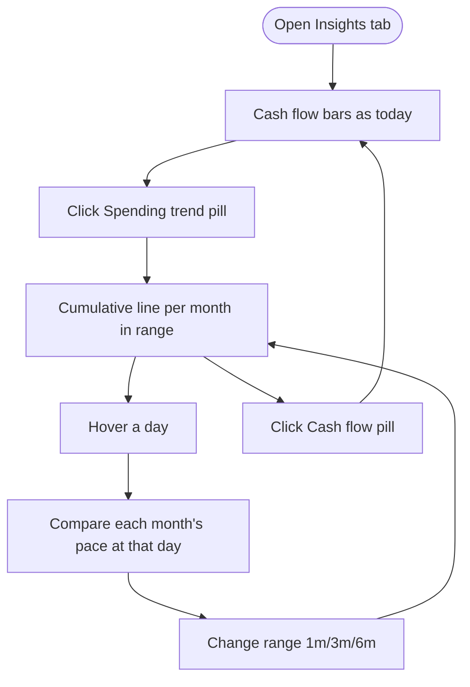

# Insights Spending Trend — Specification

## Problem Statement
I can see how much I spent per month, but not how a month *unfolded* — by the 25th, am I pacing ahead of or behind last month? Banking apps answer this with a cumulative spending-trend line; my Insights tab can't.

## Solution
Inside the existing Cash flow panel, a pill toggle switches between the cash-flow bars and a Spending trend view: one cumulative day-by-day spend line per month in the selected range, newest month solid and ending at today with a marker, older months dashed and faded. Hovering a day shows every month's total-to-that-day. The range selector and category exclusions keep working exactly as they do for cash flow.

## User Stories
1. As a budget-conscious user, I want to see this month's cumulative spend curve, so that I know my pace before the month ends.
2. As a user comparing months, I want previous months' curves overlaid, so that pacing differences are visible at a glance.
3. As a user of the range selector, I want the trend to respect my selected window, so that 3m shows three curves and 6m shows six.
4. As a user who excludes categories (e.g. rent, transfers), I want the trend to respect my exclusions, so that the curve reflects the spending I actually track.
5. As a user mid-month, I want the current month's line to stop at today with a clear end marker, so that a short line reads as "month in progress", not "low spending".
6. As a user hovering the chart, I want each month's cumulative value at that day-of-month, so that I can compare pace on any given day.
7. As a privacy-mode user, I want trend amounts blurred like every other panel, so that shoulder-surfing reveals nothing.
8. As a user toggling back to Cash flow, I want the bars view unchanged, so that the new view costs me nothing I had.
9. As a user with no spending in a window month, I want that month to render as a flat zero line rather than vanish, so that "no data" and "no spend" stay distinguishable.
10. As a user on months of different lengths, I want day 29–31 handled honestly, so that a 28-day February compares fairly against a 31-day March.

## Acceptance Criteria
- **AC1:** Given the Insights tab with the Cash flow panel, When I click the "Spending trend" pill, Then the bars are replaced by cumulative spend lines — one per month in the selected range — and clicking "Cash flow" restores the bars unchanged.
- **AC2:** Given a selected range of N months, When the trend renders, Then the window is the current partial month plus preceding full months, max(2, N) lines total (1m → current + last; 3m → current + 2 prior; 6m → current + 5 prior); the newest is solid, older ones dashed/faded.
- **AC3:** Given the current month is partial, When its line renders, Then it ends at today's day-of-month with an end marker and no values are drawn beyond today.
- **AC4:** Given excluded categories, When the trend computes, Then money-out transactions in excluded categories are omitted, exactly as the cash-flow bars omit them; income never counts as spend.
- **AC5:** Given I hover a day position, When the tooltip shows, Then it lists each month's cumulative spend at that day-of-month, blurred under privacy mode.
- **AC6:** Given a month in the window with zero qualifying spend, When the trend renders, Then that month shows a zero baseline line, not an absent series.

## User Journey

## Test Points
Confirmed at the gate: (1) one pure data-module function carrying all math — window bucketing, exclusion filtering, money-out-only, cumulative accumulation, partial current month, zero-spend months, month-length boundaries (incl. leap February); (2) source assertions for the toggle and wiring. Chart rendering verified by screenshot at the UI feedback loop, not unit tests.

## Implementation Decisions
- The trend is a second view of the existing Cash flow panel, switched by a pill toggle in the panel header; no new panel.
- All computation is client-side from already-loaded transactions; no API or storage changes.
- The trend follows the range selector (user decision, against recommendation, recorded in intent); it includes the current partial month — a deliberate, view-local exception to the other trend panels' exclusion convention.
- Window per range, explicit: 1m → 2 lines, 3m → 3, 6m → 6, All time → capped at 12 for readability; an unknown future range id falls back to 6. *(Amended post-gate during review triage — the "All time" case was undefined at spec time; this amendment is the rework signal working as designed.)*
- Curve math lives in one pure function in the data module; the view only renders its output.
- Rendering reuses the existing multi-line SVG chart idiom (hover index, tooltip, series colors), not a new chart library.
- Days axis runs 1..31; shorter months simply end early — no normalization, honest lengths (matches AC10's fairness by *visibility*, not by rescaling).

## Testing Decisions
- Good test = feed transactions in, assert the per-month cumulative arrays out; no DOM, no implementation details.
- Behavioral cases pinned: exclusions, income ignored, partial current month cut at `now`, zero-spend month emits zeros, leap-day February, 31-day month end, range window membership.
- Prior art: the portfolio performance function's test suite (same module, same style — including its month-end regression tests).
- Wiring: source assertions per the insights test file's existing style.

## Dependencies
Existing: range filter, exclusion set, transaction shape (date, amount, category), money formatter, privacy mode, multi-line chart idiom.

## Out of Scope
Month picker; Money Out/Money In tabs; budgets/spending tracker; changing other panels' current-month convention; backend changes.

## Further Notes
Reference screenshot: DBS "Spending trend" (cumulative current-vs-last with day tooltip). Ours generalizes it to N months via the range selector.
