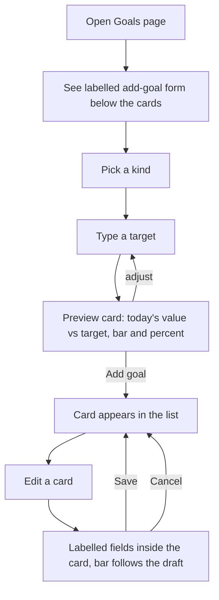

# Goal form redesign — labelled fields + live progress preview — Spec

## Problem Statement
On the Goals page the "add goal" form is a bare row of unlabelled boxes — a kind dropdown, placeholder-only inputs and a naked date field — while the rest of the page (hero, cards, suggestions) is finished. Editing a goal drops the card into the same unlabelled row. While typing a target the user has no idea where they stand today, so "S$1.45m" or "8%" is a guess until the goal is saved and the card appears.

## Solution
The add form and the edit form use the same labelled field style the Assets tab already uses: a caption above every field, fields laid out in a grid on a tinted band, the action button in its own row. Under the fields a mini goal card previews the goal being typed — the same bar, percentage and "current vs target" line the saved cards show — recomputed from today's portfolio on every keystroke. Saving produces exactly the goal it did before.

## User Stories
1. As a portfolio user, I want the add-goal form to read like the rest of the app, so that I know what each box is for without guessing from placeholders.
2. As a portfolio user typing a target, I want to see how far I already am today, so that I set targets that mean something.
3. As a portfolio user editing a goal, I want the same clear form and a bar that follows my new target, so that editing feels like a smaller version of creating.

## Acceptance Criteria
- **AC1:** Given the Goals page, When the add form renders, Then every field has a visible caption (Goal kind, Goal name, Target S$ / Debt / Asset class / Target %, Target date), the fields sit in the labelled-grid style used on the Assets tab, and the Add goal button sits in an actions row.
- **AC2:** Given the add form with kind *Net worth*, When I type a target amount, Then a preview card shows today's net worth against that amount as a bar and percentage, with the same "current of target" text a saved card shows; When the target is empty, Then the preview shows today's net worth and asks for a target instead of a percentage.
- **AC3:** Given kind *Pay off a debt* and a chosen debt, When the preview renders, Then it shows that debt's current balance as the amount to clear and 0% progress (the baseline is captured on save), and says so in one short line.
- **AC4:** Given kind *Asset allocation*, When I pick a class and type a target %, Then the preview shows the class's current share against the target with the same ±2 pp done rule as saved cards.
- **AC5:** Given a target already met today (net worth above the amount, or a class already inside the band), When the preview renders, Then it reads "Reached" like a done card would.
- **AC6:** Given I submit the form, Then the goal payload sent (kind, name, target_amount / debt_id / asset_kind + target_pct, target_date) is unchanged from today's behaviour, the form resets, and the new card appears.
- **AC7:** Given a goal card in Edit mode, When it renders, Then the name / target / date fields carry captions in the same labelled style, and the card's progress bar and percentage follow the draft target as I type; Cancel restores the saved values.
- **AC8:** Given goals created earlier (any kind, including legacy documents without `kind`), When the page loads, Then their cards render exactly as before.

## User Journey

## Implementation Decisions
- The add form is rebuilt on the Assets-tab labelled form idiom (tinted band, caption-above-field grid, actions row); kind-specific fields swap inside the same grid. No new visual system.
- The preview is a draft goal object run through the existing progress helper with the page's live goal context (net, total assets, allocation by class, debts by id); the preview renders with the same bar / percentage / target-text pieces the saved cards use. Debt drafts get the chosen debt's current balance as baseline so the preview reads 0%.
- Edit mode reuses the same labelled fields and runs the same helper on the draft so the card's bar tracks the draft.
- The live goal context and progress helper already exist and are passed down; the form gains that context as a prop. No API, repository, data-layer or payload changes.
- Cache-busters for the changed static files are bumped.

## Testing Decisions
- Test points, highest seam first:
  1. **Source-shape tests** in the existing dashboard JS suite (the codebase's pattern for JSX): the goals source uses the labelled-grid classes and captions, contains a preview that calls the progress helper on a draft, the edit branch carries captions, and the cache-buster is bumped.
  2. **Progress semantics** are already covered by the data-layer tests and are not re-tested here — the preview must call that helper, not re-derive the math.
  3. **Seen running**: screenshots of the add form (each kind, with and without a target) and of a card in Edit mode on a throwaway account seeded through the API.
- Prior art: `page-portfolio.test.js` goal tests (regex over `page-goals.jsx`, `styles.css`, `index.html`).

## Out of Scope
- Storing a net-worth baseline / growth-since-set progress
- Collapsible or modal form; multi-step wizard
- Projection/ETA inside the form
- Changes to hero, suggestions panel, sorting, or goal semantics

## Further Notes
- Progress is, and remains, computed client-side from the current portfolio on every render; the only stored derived value is the debt-payoff baseline.

## Dependencies
- Existing: progress helper, goal context memo, labelled-form CSS, card CSS, goal routes. No new packages.
