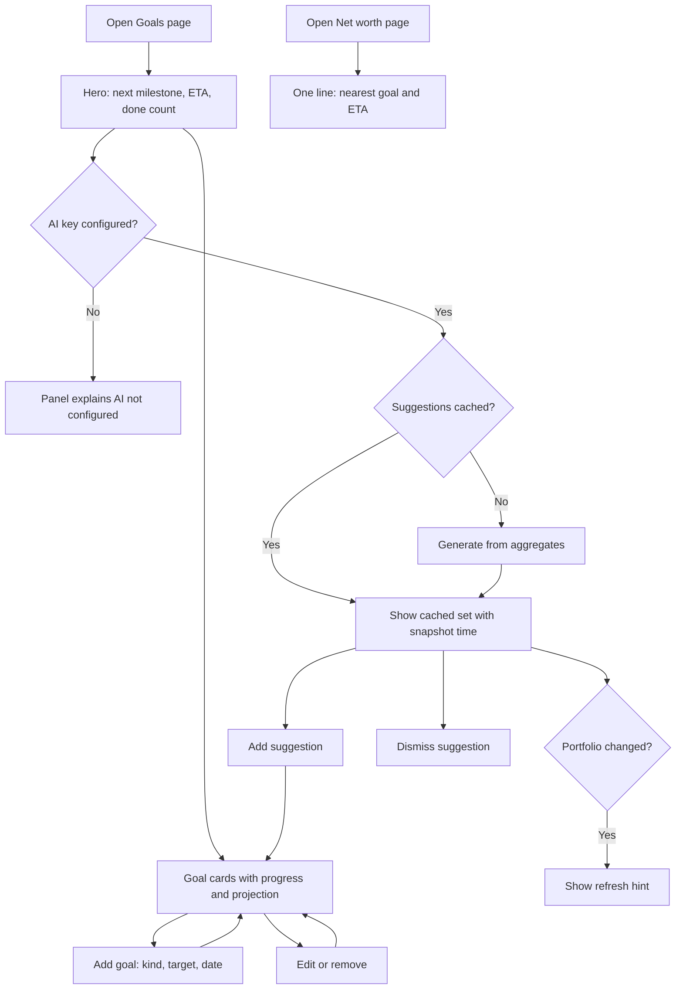

# Portfolio goals — richer kinds, projections, AI suggestions — Specification

## Problem Statement
The Goals page offers one kind of goal (reach net worth X), shows a bare progress bar, and cannot say when a goal will be reached or whether it is the right goal. Users who track debts and allocations have nothing to aim those at, and users who don't know what to aim for get no help.

## Solution
Goals become three kinds — **net-worth milestone**, **debt payoff**, **asset-class allocation** — each with a progress reading and, where history allows, an on-track projection ("on this trend: Mar 2027", "need +S$1,200/month"). The Goals page opens with a summary hero (next milestone, its ETA, goals done), lists goal cards, and offers an **AI suggestions** panel: 3–5 concrete goals proposed from portfolio aggregates, each addable in one click, dismissible, refreshable. The Net worth page shows one line naming the nearest goal and its ETA.

## User Stories
1. As a portfolio user, I want a goal to pay off a specific debt, so that progress reflects what I've actually paid down since I committed.
2. As a portfolio user, I want a goal for how much of my assets sits in a class (e.g. 30% Equities), so that I can steer allocation, not only size.
3. As a portfolio user, I want existing net-worth goals to keep working exactly as before, so that nothing I set up is lost.
4. As a portfolio user, I want each goal to say when I'll reach it on my current trend, so that "on track" is a date, not a feeling.
5. As a portfolio user with a dated goal, I want to know the monthly pace needed to hit the date, so that I can act on the gap.
6. As a portfolio user with little history, I want the page to say "not enough history" rather than invent a projection, so that I can trust what it does show.
7. As a portfolio user, I want the Goals page to summarise where I stand (next milestone, ETA, done count), so that I get the picture before the list.
8. As a portfolio user, I want AI-proposed goals based on my portfolio, so that I have sensible targets without inventing them.
9. As a portfolio user, I want each AI suggestion to come with its reason and priority, so that I can judge it.
10. As a portfolio user, I want to add a suggestion in one click and edit it later like any goal, so that adopting advice is cheap.
11. As a portfolio user, I want to dismiss suggestions I don't like and have them stay dismissed, so that the panel doesn't nag.
12. As a portfolio user, I want to know when suggestions are stale and refresh them on demand, so that I control when the AI is consulted.
13. As a privacy-conscious user, I want the AI to receive only aggregates, so that my holdings and tickers never leave the app.
14. As a portfolio user without an AI key configured, I want the rest of the Goals page to work and the panel to say why it's empty, so that AI is optional.
15. As a portfolio user, I want the Net worth page to name my nearest goal and its ETA, so that the headline number has a destination.
16. As a portfolio user whose debt was deleted, I want its payoff goal to say so and let me remove it, so that stale goals don't mislead.

## Acceptance Criteria
- **AC1:** Given the goal form, When I choose kind *Debt payoff*, pick a debt and optionally a date, and save, Then the goal stores that debt and its current balance as baseline, and shows progress = (baseline − current balance) ÷ baseline, done at balance 0.
- **AC2:** Given the goal form, When I choose kind *Allocation*, pick an asset class and a target %, and save, Then the goal shows the class's current share of total assets and is done when that share is within ±2 pp of the target; progress = 1 − |current − target| ÷ target, floored at 0.
- **AC3:** Given goals created before this change (no kind), When the page loads, Then they render and behave as net-worth milestones.
- **AC4:** Given a net-worth goal and ≥2 net-worth history points spanning ≥30 days with a rising trend, When the card renders, Then it shows a projected completion date; Given a target date, Then it also shows the monthly change needed to hit it.
- **AC5:** Given a debt-payoff goal with ≥2 balance points spanning ≥30 days and a falling balance, When the card renders, Then it shows the projected payoff date from that debt's own history.
- **AC6:** Given fewer than 2 points, less than 30 days of history, or a trend that never reaches the target, When the card renders, Then it shows "not enough history" or "not on track at current trend" instead of a date.
- **AC7:** Given any goals, When the Goals page loads, Then the hero shows the nearest unfinished goal (highest progress), its ETA or "—", and "N of M done".
- **AC8:** Given the Net worth page, When goals exist, Then one line under the hero names the nearest goal and its ETA; with no goals, the line links to add one.
- **AC9:** Given `DEEPSEEK_API_KEY` is set and no suggestions are cached, When I open the Goals page, Then the panel generates 3–5 suggestions, each with kind, target, optional date, one-line rationale and priority, and shows the snapshot time.
- **AC10:** Given suggestions are shown, When I click *Add*, Then a goal of that kind is created immediately and appears in the list; the suggestion leaves the panel.
- **AC11:** Given suggestions are shown, When I click *Dismiss*, Then it disappears and does not return on reload or refresh of the same cache generation.
- **AC12:** Given cached suggestions, When my net worth or goal count differs from the snapshot they were built on, Then the panel shows a "portfolio changed — refresh" hint; When I click *Refresh*, Then a new set replaces the old (dismissals reset).
- **AC13:** Given any generation, Then the request sent to the AI contains only: net worth, total assets, total debts, per-class allocation (name, %, value), each debt's kind/balance/APR/monthly (no names), the 12-month net-worth trend, and existing goals (kind, target, progress) — no asset names, tickers, units or transactions.
- **AC14:** Given `DEEPSEEK_API_KEY` is unset, When I open the Goals page, Then the suggestions panel explains AI is not configured and everything else works.
- **AC15:** Given a debt-payoff goal whose debt no longer exists, When the card renders, Then it says the debt was removed and offers *Remove goal*.
- **AC16:** Given the API receives an invalid goal payload (unknown kind, missing debt/class, target % outside 1–100, unknown debt id), Then it responds 400 with the validation message.

## User Journey

## Test Points
1. Pure JS `computeGoalProgress` / `projectGoal` in the dashboard data helpers (primary; both timezones).
2. Pure Python aggregate builder and suggestion normaliser in the advisor module; cache read/write/dismiss with mocked Mongo.
3. Repository goal create/update per kind; baseline capture; legacy default kind.
4. Suggestions route and goal routes with the new payloads.
5. Source-regex wiring checks for the redesigned page.

## Implementation Decisions
- Goal document gains `kind` ∈ {`net_worth`, `debt_payoff`, `allocation`} (absent ⇒ `net_worth`), plus kind fields: `debt_id` + `baseline` (debt payoff; baseline captured server-side from the debt's current value at creation, immutable), `asset_kind` + `target_pct` (allocation; 1–100). `target_amount` is required only for net-worth goals; kind is immutable after creation.
- Progress and projection are computed client-side from data the page already holds (same principle as the original goals plan); the server does no goal math.
- Projection = least-squares linear fit over the dated points (net-worth monthly history for net-worth goals; the debt's own valuations for debt goals). Requires ≥2 points spanning ≥30 days. ETA = date the fitted line crosses the target if the slope points toward it; monthly-needed = (target − current) ÷ months to target date. Allocation goals: no projection.
- Nearest goal = unfinished goal with the highest progress; ties by earliest target date.
- AI advisor: new module mirroring the AI Coach module (DeepSeek client/config, strict-JSON prompt, `json_object` response format, fence-stripping fallback). Input is an aggregate built from the portfolio snapshot; the prompt asks for 3–5 suggestions as `{kind, name, target_amount|target_pct|debt_ref, target_date, rationale, priority}`. Debts are referred to by index in the aggregate so the model never sees names; the normaliser maps indexes back to ids and drops anything malformed, duplicate of an existing goal, or out of range.
- Cache: one document per user in a new collection — `{suggestions, snapshot:{net, goal_count}, generated_at, dismissed_ids}`. One route handles it: `POST /api/portfolio/goals/suggestions` with optional `force_refresh` and `dismiss` (suggestion id). 503 when the key is missing (same as AI Coach), 502 on feed failure. The advisor module is imported lazily inside the route (test suite stubs pandas at module level).
- The route builds the snapshot server-side from the portfolio (assets, debts, valuations, goals) so the client cannot shape what the AI sees.
- Stale hint: client compares current net worth (rounded) and goal count with `snapshot`; no server call.
- UI: Goals page = hero (`StatBlock`s in the existing hero idiom) + goal cards (kind tag, progress bar, projection line, edit/remove) + suggestions panel (cards with Add/Dismiss, Refresh button, snapshot time, stale hint). Goal form gains a kind selector that swaps fields. Net worth hero gains one line. Existing CSS classes reused; a small block of goal-card CSS added.
- Cache-busters bumped for every changed static file.

## Testing Decisions
- Good tests assert behaviour: given goal + context → progress/done/projection; given portfolio snapshot → the exact aggregate shape (and that names/tickers are absent); given raw model JSON → normalised suggestions; given payloads → stored docs / HTTP codes.
- Prior art: `dashboard/app/data.test.js` (pure helpers, run also under `TZ=America/New_York`), `tests/unit/test_market_data.py` (pure builder + patched fetch), `tests/integration/test_portfolio_repository.py` (MagicMock Mongo; goal CRUD tests), `tests/test_portfolio_api.py` (goal route tests; `_JsonRequest`), `dashboard/app/page-portfolio.test.js` (source regex).
- The DeepSeek call is not unit-tested; the UI round exercises it live once.

## Dependencies
- Existing: DeepSeek key/config, `openai` client, Mongo, portfolio repository, valuation histories already loaded by the page.
- No new packages.

## Out of Scope
- Goal history charts / progress over time
- Notifications, celebrations, archiving of done goals (done goals stay listed with "Done" and can be removed)
- Manual ordering of goals (sorted: unfinished by progress desc, then done)
- AI editing or deleting existing goals; AI suggestions inside the AI Coach page
- Per-holding goals ("ADSK to S$X"), savings-rate goals, contribution tracking
- FX / multi-currency (S$ throughout)

## Further Notes
- Debt baseline is captured once; if the user wants a fresh start they delete and recreate the goal.
- Suggestions referencing a debt that has since been deleted are dropped by the normaliser at read time.
